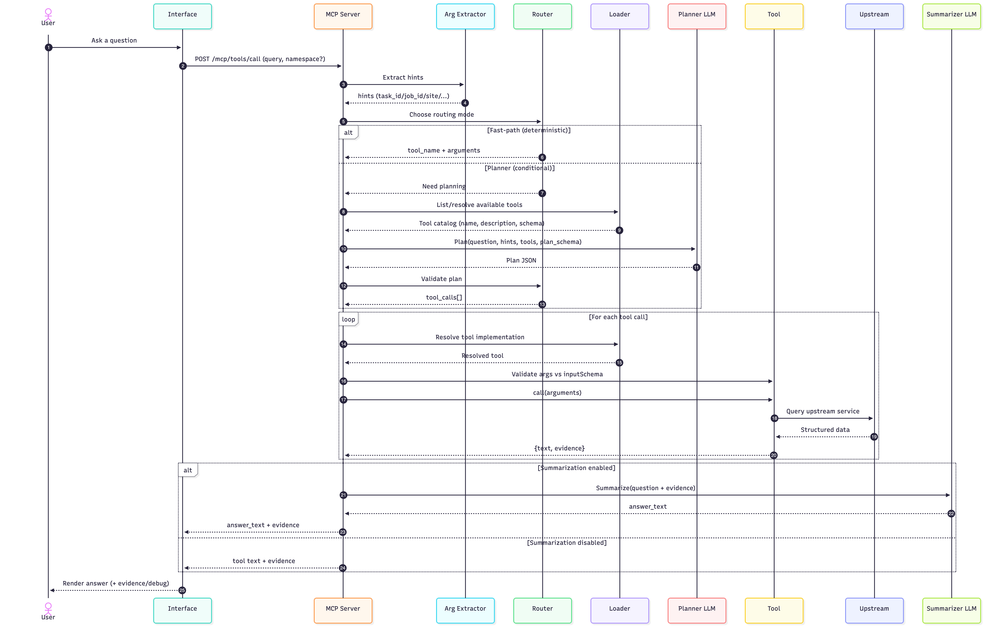

# MCP workflow, tool orchestration, and LLM usage

## What MCP provides

Bamboo runs an MCP server (HTTP) that publishes a catalog of tools and executes tool calls.

MCP does not require an LLM to choose tools. Tool selection can happen in the client, in the server, or both.

## Tool discovery

Tools are discovered via Python entry points in the `bamboo.tools` group (with an optional legacy fallback to `askpanda.tools`).

Example entry point:

```toml
[project.entry-points."bamboo.tools"]
"atlas.task_status" = "askpanda_atlas.task_status:panda_task_status_tool"
```

## Tool execution contract

Each tool provides:

- `get_definition() -> dict` including an `inputSchema` (JSON Schema)
- `async call(arguments: dict) -> dict` returning:

```json
{
  "text": "Human summary",
  "evidence": {"structured": "data"}
}
```

Tools are authoritative and produce evidence. Any LLM output is presentation-only.

## Orchestration model

Bamboo supports two complementary orchestration styles:

1. **Client-driven**: an MCP client can read `/tools/list` and let a host LLM choose tools.
2. **Server-driven (Bamboo hybrid router)**: Bamboo can route requests itself, using deterministic rules first and an LLM planner only when needed.

### Step 1: Argument extraction

Deterministically extract hints from the user query (for example `task_id`, `job_id`, `site`). These hints are passed to routing and (optionally) to the planner.

### Step 2: Fast-path routing (deterministic)

If the hints are unambiguous, Bamboo directly selects a tool and validates arguments against the tool’s `inputSchema`.

### Step 3: Planner routing (conditional)

If intent is ambiguous or the query requires a multi-step workflow, Bamboo can call the **planner tool**:

- MCP tool name: `bamboo_plan`
- Implementation: `core/bamboo/tools/planner.py`

The planner proposes a **plan object** (JSON) describing which tools to call and with what arguments. The plan is validated before execution.

## Planner prompt sketch

The planner uses two messages.

**System prompt (conceptual):**

- You are a tool planner for an MCP server.
- Output MUST be a single JSON object.
- Output MUST validate against the provided JSON Schema.
- Do not wrap output in Markdown.
- Only propose tools present in the provided tool catalog.

**User message (payload):**

```json
{
  "question": "...",
  "hints": {"task_id": 123456},
  "tools": [
    {"name": "panda_task_status", "description": "...", "inputSchema": {}},
    {"name": "panda_log_analysis", "description": "...", "inputSchema": {}}
  ]
}
```

## Plan JSON Schema

The authoritative schema is generated from the Pydantic model in `bamboo.tools.planner`:

```python
from bamboo.tools.planner import get_plan_json_schema

schema = get_plan_json_schema()
```

The planner extracts the first JSON object from the model output, validates it, and performs at most one repair attempt.

## LLM summarization

LLMs are invoked **after** tool execution. Input to the summarizer should include the original question and the structured evidence, plus rules such as “do not invent facts”. The LLM is treated as a presentation layer.

## Sequence diagram


